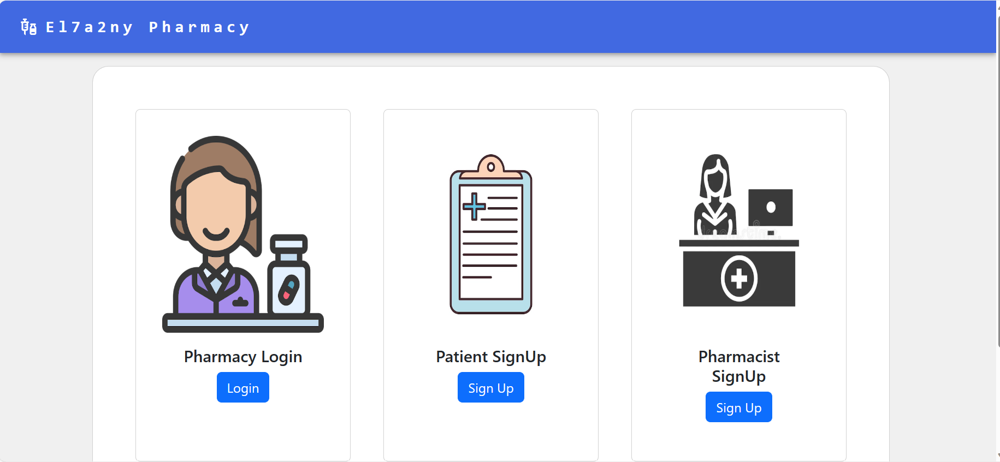
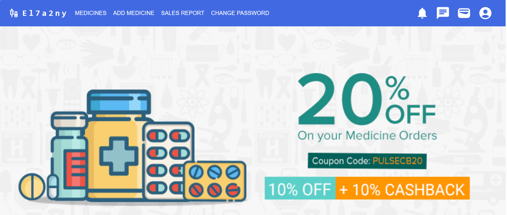
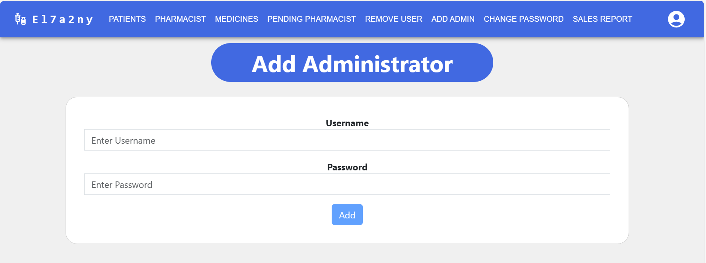
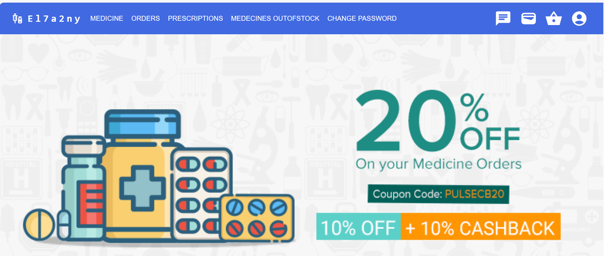
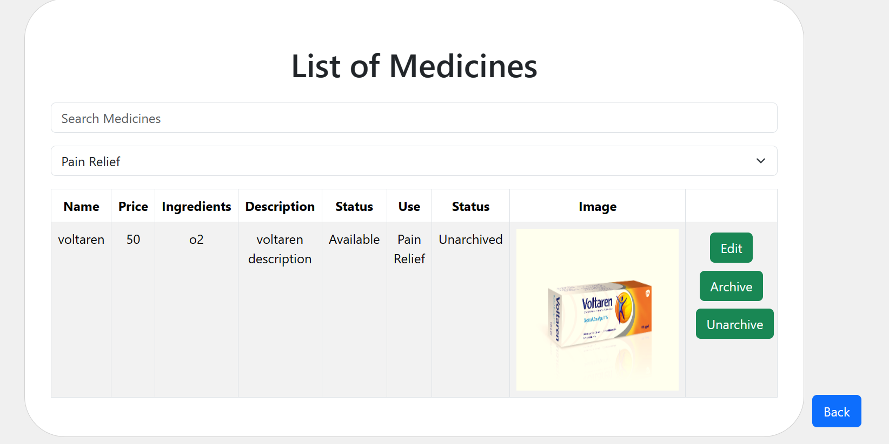
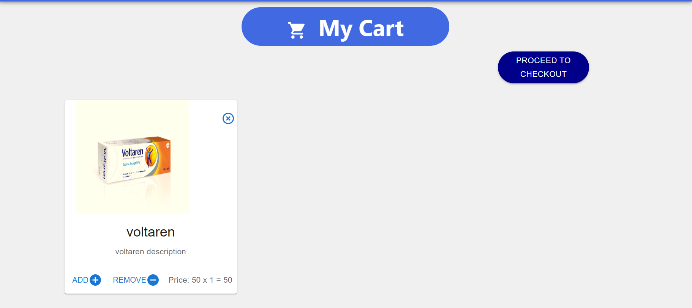

# El7a2ny - Virtual Pharmacy Management System
Welcome to El7a2ny, A comprehensive software solution designed to automate and facilitate the interactions between patients, medical professionals, clinics, and pharmacists. This system is integrated with clinics and allows for seamless access to medical history, ordering of prescribed medication, and much more.

## Motivation
✨El7a2ny is here to make healthcare easy for everyone. ✨
This system aims to improve the efficiency of healthcare services and enhance the patient experience by providing a convenient platform for managing their medical needs.
 With El7a2ny, we're bringing a new level of ease and convenience to healthcare interactions. 😉


## Badges 


## Table of Contents

- [Build Status](#build-status-🔨)                     
- [code style](#code-style-📜)                         
- [screenshots](#screenshots-🖵)                        
- [Tech/Framework Stack](#techframework-used-🧰)    
- [Features](#features-✨)                           
- [Code Examples](#code-examples-🐱‍💻)                 
- [configuration](#configuration)                 
- [Installation](#installation-📥)                   
- [API reference](#api-reference)                     
- [Tests](#testing-with-postman)                                 
- [How to Use?](#how-to-use)
- [Contributing](#contribute)
- [Credits](#credits)
- [License](#license)


## Build Status 🔨

[](https://github.com/advanced-computer-lab-2023/Apollo-8-Pharmacy/actions/workflows/build.yml)

- The project is currently in development.
- missing a main home page for a guest.
- The testing technique needs improvement. Plan to create Jest test files and enable them as workflows for more robust and efficient testing.
- Future improvements:
  - Implement a caching layer to improve application performance.
  - Integrate a message broker to handle asynchronous tasks such as sending emails and notifications.

## Code Style 📜

This project adheres to the following code style guidelines:

1. **Naming Conventions**: 
- For Variables and function names, Use camelCase.

2. **Comments**:
- Add comments before functions and complex logic to explain their purpose.
- Keep comments concise and informative.

3. **File Organization**
- The project is organized into the following main directories:
  - `server`: Backend server code.
  - `client`: Frontend React application.

4. **Version Control**
- Use Git for version control.
- Write clear and concise commit messages following [Conventional Commits](https://www.conventionalcommits.org/) guidelines.

5. **Whitespace**:
- Use whitespace to make the code more readable. There should be whitespace around operators and after commas.

6. **Coding Standards**
- Follow the [Airbnb JavaScript Style Guide](https://github.com/airbnb/javascript) for our JavaScript/React code.

Please ensure your code adheres to these guidelines before submitting a pull request.

## screenshots 🖵

### Main Registeration page

Screenshot of the Main page, which serves as the registration portal. It includes sign-up options for pharmacists and patients, and sign-in options for administrators, pharmacists, and patients.



### pharmacist Homepage 

This is the main interface for pharmacists after signing in, providing access to all pharmacist-specific features and functionalities.



### Admin Homepage

This is the main interface for Admin after signing in, providing access to all Admin-specific features and functionalities.



### patient Homepage

This is the main interface for patient after signing in, providing access to all patient-specific features and functionalities.



### Medicine list

Patients can view all the Medicines uploaded by the Pharmacists



### Patient's cart

Responsive shopping cart, customizable by the patient according to their evolving needs.



## Tech/Framework used 🧰

El7a2ny is built using the MERN (MongoDB, Express.js, React, Node.js) stack.

- Tool:
    - VS code
    
- Frontend:
    - React
    - Bootstrap
    - Material-UI

- Backend:
    - Node.js  v18.18.0.
    - Express.js
    - MongoDB
    
## Features ✨

### Guests

- **Registration:**
  - Register as a patient.
  - Submit a request to register as a pharmacist.

### Patients/Pharmacists/Administrators

- **Authentication and Profile Management:**
  - Login with username and password.
  - Logout.
  - Change password.
  - Reset a forgotten password through OTP sent to email.

### Administrators

- **User Management:**
  - Add another administrator with a set username and password.
  - Remove a pharmacist/patient from the system.
  - View all of the information uploaded by a pharmacist to apply to join the platform.
  - Accept or reject the request of a pharmacist to join the platform.

### Pharmacists

- **Medicine Management:**
  - Upload and submit required documents upon registration such as ID, pharmacy degree, and working licenses.
  - View the available quantity and sales of each medicine.
  - Add a medicine with its details (active ingredients), price, and available quantity.
  - Upload medicine image.
  - Edit medicine details and price.
  - Archive/unarchive a medicine.

### Patients

- **Order Management:**
  - Add an over-the-counter medicine to the cart.
  - Add a prescription medicine to the cart based on the prescription.
  - View cart items.
  - Remove an item from the cart.
  - Change the amount of an item in the cart.
  - Checkout the order.
  - Add a new delivery address (or multiple addresses).
  - Choose a delivery address from the delivery addresses available.
  - Choose to pay with wallet, credit card (using Stripe), or cash on delivery.
  - View current and past orders.
  - View order details and status.
  - Cancel an order.
  - View alternatives to a medicine that is out of stock based on the main active ingredient.
  - Chat with a pharmacist.


and much more to discover... 😊🚀

## Code Examples 🐱‍💻

here are some code examples for developers to have an overview about our implementation

#### signup patient:
```javascript
const createPatient = async (req, res) => {
  // Destructure required fields from request body
  const { username, name, email, password, /* ... other required fields */ } = req.body;

  // Generate salt and hash the password
  const salt = await bcrypt.genSalt(saltRounds);
  const hashedPassword = await bcrypt.hash(password, salt);

  try {
    // Create a new user with the hashed password
    const user = new UserModel({ username, password, type });
    user.password = hashedPassword;
    await user.save();

    // Create a new patient associated with the user
    const patient = new PatientModel({ user: user._id, name, email /* ... other required fields */ });
    await patient.save();

    // Respond with the created patient data
    res.status(200).json(patient);
  } catch (error) {
    res.status(400).json({ error: error.message });
  }
};

```

#### login Patient:
```javascript
const loginPatient = async (req, res) => {
  try {
    // get the username and password from the request body
    const { name, password } = req.body;

    // Find the user by username
    const user = await UserModel.findOne({ username: name });

    // Check if the password matches and the user type is 'patient'
    const passwordMatch = user && (await bcrypt.compare(password, user.password));
    if (!passwordMatch || !(user?.type.toLowerCase() === 'patient')) {
      return res.status(400).json("Wrong username or password");
    } 

    else {
      // Generate a token and set it as an HTTP-only cookie
      const token = createToken(user.username);
      res.cookie('jwt', token, { httpOnly: true, maxAge: maxAge * 1000 });

      // Respond with the token
      return res.status(201).json({ token });
    }
  } catch (err) {
    return res.status(400).json("Wrong username or password");
  }
};

```

#### view patient's cart:
```javascript
const viewCart = async (req, res) => {
  try {
    // Find patient by user ID and populate medicine details in the cart
    const patient = await PatientModel.findOne({ user: res.locals.userId }).populate('cart.medicine');

    // Extract relevant details from the patient's cart
    const cartDetails = patient.cart.map(item => ({
      medicine: item.medicine,
      quantity: item.quantity,
    }));

    // Respond with the cart details
    res.status(200).json(cartDetails);
  } catch (error) {
    res.status(500).json({ error: error.message });
  }
};

```
#### Add a medicine as a pharmacist:
```javascript
const addMedicine = async (req, res) => {
  try {
    const { medicineName, price, ingredients, /* ... other required fields */ } = req.body;

    // Extract image file details from the request
    let files = {};
    req.files.forEach(file => {
      if (file.fieldname === "image") {
        files = { ...files, image: file.filename };
      }
    });

    // Create a new MedicineModel instance with the provided details
    const medicine = new MedicineModel({
      medicineName,price,quantity,ingredients, /* ... the same fields as above */
      ...files});

    // Save the new medicine to the database and send its details
    await medicine.save();
    res.status(200).json(medicine);

  } catch (error) {
    res.status(400).json({ error: error.message });
  }
};

```
## Configuration

### 1. Database Connection

Before running the project, make sure to set up your database connection by adding your MongoDB connection string to the `.env` file located in the `server` directory. Here's an example:

```env
DB_CONNECTION=mongodb+srv://<username>:<password>@your_cluster_url/your_database_name
```
### 2. Admin Setup

To ensure smooth operation of the system, it's necessary to manually add at least one admin user to your database. This can be done using MongoDB Compass.

## Installation 📥

Follow these steps to set up the project on your local machine:

1. **Clone the Repository:**
   ```bash
   git clone https://github.com/advanced-computer-lab-2023/Apollo-8-Pharmacy.git
   ```
   
2. **Open the Project in Visual Studio Code**

3. **choose view terminal and Setup the Server:**
```
cd sever
npm install
npm install mongoose node
```
4. **Start the Server:**
```
node index.js
```
5. **Open Another Terminal for the Client:**
```
cd client
npm install
npm install react react-dom
npm install react-bootstrap
npm install @mui/material @emotion/react @emotion/styled
```
6. **Start the Client Application:**
```
cd src
npm run dev
```
7. **Open any web browser and navigate to**
```
http://localhost:5173/
```

## API reference

<details> <summary>pateint APIs</summary>

#### POST /patient/
- **Purpose:** Create a new patient account.
- **Authentication:** None
- **HTTP Method:** POST
- **Parameters:**
    - Body parameters -
        - username (string),
        - name (string),
        - type (string),
        - email (string),
        - password (string),
        - birthDate (string),
        - gender (string),
        - phone (string),
        - emergencyName (string),
        - emergencyNo (string),
        - emergencyRel (string),
        - adresses (array),
        - status (string)
- **Response:**
    - Status 200: JSON object of the created patient.
    - Status 400: Error message if there's an issue.
    - Status 404: Username already exists.

#### POST /patient/PatientLogin
- **Purpose:** Authenticate a patient and provide a JSON Web Token (JWT) for subsequent requests.
- **Authentication:** None
- **HTTP Method:** POST
- **Parameters:**
    - name (string): The username of the patient.
    - password (string): The password of the patient.
- **Response:**
    - Status 201: JSON object with a success message and the JWT token in a cookie.
    - Status 400: JSON object with an error message if the provided username or password is incorrect.

#### GET /patient/
- **Purpose:** Retrieve a list of all patients.
- **Authentication:** None
- **HTTP Method:** GET
- **Parameters:** None
- **Response:**
    - Status 200: Array of patients.
    - Status 400: Error message if there's an issue.

#### GET /patient/byId
- **Purpose:** Retrieve patient details by their ID.
- **Authentication:** Required (Admin)
- **HTTP Method:** GET
- **Parameters:** None
- **Response:**
    - Status 200: JSON object of the patient details.
    - Status 404: Patient not found.
    - Status 500: Internal server error.

#### POST /patient/addToCart
- **Purpose:** Add a medicine to the patient's cart.
- **Authentication:** Required (Patient)
- **HTTP Method:** POST
- **Parameters:**
    - Body parameters - medicineId (string), quantity (number) - ID of the medicine and quantity to add to the cart.
- **Response:**
    - Status 200: Array of items in the cart.
    - Status 404: Medicine or patient not found.
    - Status 400: Medicine is out of stock.

#### GET /patient/checkIfMedicineIsAdded/:medicineId
- **Purpose:** Check if a specific medicine is already added to the patient's cart.
- **Authentication:** Required (Patient)
- **HTTP Method:** GET
- **Parameters:**
    - Path parameter - medicineId (string) - ID of the medicine.
- **Response:**
    - Status 200: JSON object indicating if the medicine is added.
    - Status 404: Patient not found.

#### POST /patient/addToCartFromClinic
- **Purpose:** Add a medicine to the patient's cart from the clinic.
- **Authentication:** None
- **HTTP Method:** POST
- **Parameters:** None
- **Response:**
    - Status 200: Array of items in the cart.

#### DELETE /patient/removeFromCartClinic
- **Purpose:** Remove a medicine from the patient's cart (clinic).
- **Authentication:** None
- **HTTP Method:** DELETE
- **Parameters:** None
- **Response:**
    - Status 404: Medicine not found in the cart.

#### GET /patient/viewCart
- **Purpose:** View the contents of the patient's cart.
- **Authentication:** Required (Patient)
- **HTTP Method:** GET
- **Parameters:** None
- **Response:**
    - Status 200: Array of items in the cart.
    - Status 404: Patient not found.

#### DELETE /:id/removeFromCart
- **Purpose:** Remove a medicine from the patient's cart.
- **Authentication:** Required (Patient)
- **HTTP Method:** DELETE
- **Parameters:**
    - Path parameter - id (string) - ID of the medicine.
- **Response:**
    - Status 200: Array of items in the cart.
    - Status 404: Medicine not found in the cart.

#### PUT /patient/incMed
- **Purpose:** Increment the quantity of a medicine in the patient's cart.
- **Authentication:** Required (Patient)
- **HTTP Method:** PUT
- **Parameters:**
    - Body parameter - medicineId (string) - ID of the medicine.
- **Response:**
    - Status 200: Array of items in the cart.
    - Status 404: Medicine not found in the cart.
    - Status 400: Cannot increment quantity. Limited to available stock.

#### PUT /patient/addAddress
- **Purpose:** Add a new address to the patient's profile.
- **Authentication:** Required (Patient)
- **HTTP Method:** PUT
- **Parameters:**
    - Body parameter - newAddress (string) - New address to add.
- **Response:**
    - Status 200: Message - "Address added successfully."
    - Status 404: Patient not found.
    - Status 500: Internal server error.

#### PUT /patient/updateWallet
- **Purpose:** Update the patient's wallet with a payment amount.
- **Authentication:** Required (Patient)
- **HTTP Method:** PUT
- **Parameters:**
    - Body parameter - paymentAmount (number) - Amount to update the wallet.
- **Response:**
    - Status 200: JSON object with the updated wallet amount.
    - Status 500: Internal server error.

#### PUT /patient/:id/decMed
- **Purpose:** Decrement the quantity of a medicine in the patient's cart.
- **Authentication:** Required (Patient)
- **HTTP Method:** PUT
- **Parameters:**
    - Body parameter - medicineId (string) - ID of the medicine.
- **Response:**
    - Status 200: Array of items in the cart.

#### GET /patient/:id/orders/:orderId
- **Purpose:** View details of a specific order for the patient.
- **Authentication:** Required (Patient)
- **HTTP Method:** GET
- **Parameters:**
    - Path parameters - id (string) - ID of the patient, orderId (string) - ID of the order.
- **Response:**
    - Status 200: JSON object of the order details.
    - Status 404: Order not found for the patient.
    - Status 500: Internal server error.

#### GET /patient/getCartTotal
- **Purpose:** Get the total amount of the patient's cart.
- **Authentication:** Required (Patient)
- **HTTP Method:** GET
- **Parameters:** None
- **Response:**
    - Status 200: Total amount of the cart.
    - Status 404: Patient not found.

#### POST /patient/:id/orders/:orderId/cancel
- **Purpose:** Cancel a pending order for the patient.
- **Authentication:** Required (Patient)
- **HTTP Method:** POST
- **Parameters:**
    - Path parameters - id (string) - ID of the patient, orderId (string) - ID of the order.
- **Response:**
    - Status 200: Message - "Order cancelled successfully."
    - Status 400: Cannot cancel order. Status is not Pending.
    - Status 404: Order not found for the patient.
    - Status 500: Internal server error.

#### GET /patient/getWallet
- **Purpose:** Get the current amount in the patient's wallet.
- **Authentication:** Required (Patient)
- **HTTP Method:** GET
- **Parameters:** None
- **Response:**
    - Status 200: Current amount in the wallet.
    - Status 404: Patient not found.
    - Status 500: Internal server error.

#### GET /patient/outofstock
- **Purpose:** Get a list of medicines that are out of stock.
- **Authentication:** Required (Patient)
- **HTTP Method:** GET
- **Parameters:** None
- **Response:**
    - Status 200: Array of out-of-stock medicines.
    - Status 500: Internal server error.

</details>

<details> <summary>Admin APIs</summary>

#### GET /admin/getUsers
- **Purpose:** Retrieve a list of all users.
- **Authentication:** Admin authentication is required.
- **HTTP Method:** GET
- **Parameters:** None
- **Response:**
    - Status 200: Array of user objects.
    - Status 400: JSON object with an error message if there's an issue.

#### POST /admin/addAdministrator
- **Purpose:** Add a new administrator.
- **Authentication:** Admin authentication is required.
- **HTTP Method:** POST
- **Parameters:** 
    - `username` (string): Username for the new administrator.
    - `password` (string): Password for the new administrator.
- **Response:**
    - Status 200: The newly created administrator object.
    - Status 400: JSON object with an error message if there's an issue.

#### DELETE /admin/removeUser
- **Purpose:** Remove a user.
- **Authentication:** Admin authentication is required.
- **HTTP Method:** DELETE
- **Parameters:** 
    - `username` (string): Username of the user to be removed.
- **Response:**
    - Status 200: JSON object with a success message.
    - Status 404: JSON object with an error message if the user is not found.

#### GET /admin/sales/:month?
- **Purpose:** Get sales report for the specified month.
- **Authentication:** Admin authentication is required.
- **HTTP Method:** GET
- **Parameters:** 
    - `month` (number, optional): The month for which the sales report is requested. If not provided, the current month is used.
- **Response:**
    - Status 200: Array of sales report objects.
    - Status 400: JSON object with an error message if there's an issue.

#### POST /admin/createUser
- **Purpose:** Create a new user.
- **Authentication:** None
- **HTTP Method:** POST
- **Parameters:** 
    - `username` (string): Username for the new user.
    - `password` (string): Password for the new user.
    - `type` (string): Type of the new user (e.g., "Pharmacist", "Patient").
- **Response:**
    - Status 200: The newly created user object.
    - Status 400: JSON object with an error message if there's an issue.

#### POST /admin/chanePass
- **Purpose:** Change the password for the authenticated user.
- **Authentication:** User authentication is required. The user must provide a valid JWT token in the Authorization header.
- **HTTP Method:** POST
- **Parameters:**
    - `password` (string): The new password.
- **Response:**
    - Status 200: JSON object with a success message.
    - Status 401: JSON object with an error message if the user is not logged in or the token is invalid.

#### POST /admin/compare
- **Purpose:** Compare the provided username and PIN to authenticate the user and generate a JWT token.
- **Authentication:** None
- **HTTP Method:** POST
- **Parameters:**
    - `name` (string): The username of the user.
    - `PIN` (string): The Personal Identification Number (PIN) of the user.
- **Response:**
    - Status 201: JSON object with a JWT token and the user type.
    - Status 400: JSON object with an error message if the provided username or PIN is incorrect.
    - Status 500: JSON object with an error message if there's a server error.

#### POST /admin/forget
- **Purpose:** Send a verification code to the user's email for password reset.
- **Authentication:** None
- **HTTP Method:** POST
- **Parameters:**
    - `name` (string): The username of the user.
- **Response:**
    - Status 201: JSON object with a success message and email information.
    - Status 400: JSON object with an error message if the provided username is incorrect.
    - Status 500: JSON object with an error message if there's a server error.

</details>

<details> <summary>pharmacist APIs</summary>

#### POST /pharmacist/
- **Purpose:** Create a new pharmacist.
- **Authentication:** None
- **HTTP Method:** POST
- **Parameters:**
    - username (string)
    - name (string)
    - type (string)
    - email (string)
    - password (string)
    - birthDate (string)
    - hourlyRate (number)
    - hospital (string)
    - eduBackground (string)
    - wallet (object)
    - status (string)
    - Files: idFile, degreeFile, licenseFile (multipart/form-data)
- **Response:**
    - Status 200: JSON object of the created pharmacist.
    - Status 400: Error message if there's an issue.

#### GET /pharmacist/
- **Purpose:** Retrieve a list of all pharmacists.
- **Authentication:** None
- **HTTP Method:** GET
- **Parameters:** None
- **Response:**
    - Status 200: Array of pharmacists.
    - Status 400: Error message if there's an issue.

#### POST /pharmacist/PharmicistLogin
- **Purpose:** Authenticate a pharmacist and provide a JSON Web Token (JWT) for subsequent requests.
- **Authentication:** None
- **HTTP Method:** POST
- **Parameters:**
    - name (string): The username of the pharmacist.
    - password (string): The password of the pharmacist.
- **Response:**
    - Status 201: JSON object with a success message and the JWT token in a cookie.
    - Status 400: JSON object with an error message if the provided username or password is incorrect.

#### GET /pharmacist/:id
- **Purpose:** Retrieve information about a specific pharmacist by their ID.
- **Authentication:** None
- **HTTP Method:** GET
- **Parameters:**
    - id (Path Parameter): The ID of the pharmacist.
- **Response:**
    - Status 200: The pharmacist's information.
    - Status 404: If the pharmacist is not found.
    - Status 400: Error message if there's an issue.

#### GET /pharmacist/current
- **Purpose:** Retrieve information about the currently logged-in pharmacist for chat purposes.
- **Authentication:** Pharmacist authentication is required.
- **HTTP Method:** GET
- **Parameters:** None
- **Response:**
    - Status 200: The pharmacist's information.
    - Status 404: If the pharmacist is not found.
    - Status 400: Error message if there's an issue.

#### PUT /pharmacist/accept/:id
- **Purpose:** Accept a pharmacist's registration request.
- **Authentication:** Admin authentication is required.
- **HTTP Method:** PUT
- **Parameters:**
    - id (Path parameter): Pharmacist ID.
- **Response:**
    - Status 200: The updated pharmacist information after acceptance.
    - Status 404: If the pharmacist is not found.
    - Status 500: Internal Server Error.

#### PUT /pharmacist/reject/:id
- **Purpose:** Reject a pharmacist's registration request.
- **Authentication:** Admin authentication is required.
- **HTTP Method:** PUT
- **Parameters:**
    - id (Path parameter): Pharmacist ID.
- **Response:**
    - Status 200: The updated pharmacist information after rejection.
    - Status 404: If the pharmacist is not found.
    - Status 500: Internal Server Error.

#### GET /pharmacist/sales/:month?
- **Purpose:** Retrieve sales report for a specific month.
- **Authentication:** Pharmacist authentication is required.
- **HTTP Method:** GET
- **Parameters:**
    - month (Optional Query parameter): Month for which the sales report is requested. If not provided, the current month is considered.
- **Response:**
    - Status 200: Array of objects containing medicineName and totalSales.
    - Status 400: Error message if there's an issue.

#### GET /pharmacist/salesdate/:date?
- **Purpose:** Retrieve sales report for a specific date.
- **Authentication:** Pharmacist authentication is required.
- **HTTP Method:** GET
- **Parameters:**
    - date (Path parameter): Date for which the sales report is requested in the format "YYYY-MM-DD."
- **Response:**
    - Status 200: Array of objects containing medicineName and totalSales.
    - Status 400: Error message if there's an issue.

#### GET /pharmacist/getWallet
- **Purpose:** Retrieve the wallet information of the authenticated pharmacist.
- **Authentication:** Pharmacist authentication is required.
- **HTTP Method:** GET
- **Parameters:** None
- **Response:**
    - Status 200: JSON object containing the pharmacist's wallet information.
    - Status 404: JSON object with an error message if the pharmacist is not found.
    - Status 500: JSON object with an error message for internal server error.

#### GET /pharmacist/getNotfication
- **Purpose:** Retrieve notifications for the authenticated pharmacist.
- **Authentication:** Pharmacist authentication is required.
- **HTTP Method:** GET
- **Parameters:** None
- **Response:**
    - Status 200: Array of notification objects.
    - Status 400: JSON object with an error message if there's an issue.

#### GET /pharmacist/sawNotfication
- **Purpose:** Mark notifications as read for the authenticated pharmacist.
- **Authentication:** Pharmacist authentication is required.
- **HTTP Method:** GET
- **Parameters:** None
- **Response:**
    - Status 200: Array of notification objects after marking as read.
    - Status 400: JSON object with an error message if there's an issue.

</details>

<details> <summary>medicine APIs</summary>

#### GET /medicine/filter/{id}
- **Purpose:** Retrieve medicines based on medicinal use.
- **Authentication:** Required (Patient, Pharmacist, Admin)
- **HTTP Method:** GET
- **Parameters:** Query parameter - medicinalUse (string) - The medicinal use to filter medicines.
- **Response:**
    - Status 200: Array of medicines matching the medicinal use.
    - Status 200 (No medicine found): Message - "No medicine found."
    - Status 400: Error message if there's an issue.

#### GET /medicine/search/{id}
- **Purpose:** Search for medicines by name.
- **Authentication:** Required (Patient, Pharmacist, Admin)
- **HTTP Method:** GET
- **Parameters:** Body parameter - name (string) - The name to search for.
- **Response:**
    - Status 200: Array of medicines matching the name.
    - Status 400: Error message if there's an issue.

#### GET /medicine/listMedicines/{id}
- **Purpose:** Retrieve a list of all medicines with selected data.
- **Authentication:** Required (Patient, Pharmacist, Admin)
- **HTTP Method:** GET
- **Parameters:** None
- **Response:**
    - Status 200: Array of medicines with selected data (filtered fields).
    - Status 400: Error message if there's an issue.

#### PUT /medicine/update/{id}
- **Purpose:** Update medicine details.
- **Authentication:** Required (Pharmacist)
- **HTTP Method:** PUT
- **Parameters:**
    - Path parameter - id (string) - The ID of the medicine to update.
    - Body parameters - description (string), ingredients (string), price (number) - The updated details of the medicine.
- **Response:**
    - Status 200: Updated medicine object.
    - Status 400: Error message if there's an issue.

#### POST /medicine/add/{id}
- **Purpose:** Add a new medicine.
- **Authentication:** Required (Pharmacist)
- **HTTP Method:** POST
- **Parameters:** None
- **Request Body:**
    - medicineName (string), price (number), quantity (number), ingredients (string), medicineStatus (string), description (string), sales (number), medicinalUse (string) - Details of the new medicine.
    - Image file - Attached in the request using form-data with fieldname "image."
- **Response:**
    - Status 200: Newly added medicine object.
    - Status 400: Error message if there's an issue.

#### POST /medicine/updateArchiveStatus/{id}
- **Purpose:** Update the archive status of a medicine.
- **Authentication:** Required (Pharmacist)
- **HTTP Method:** POST
- **Parameters:**
    - Body parameters - medicineId (string), archivedStatus (string) - The ID of the medicine and the updated archive status.
- **Response:**
    - Status 200: Updated medicine object.
    - Status 400: Error message if there are missing parameters.
    - Status 404: Error message if the medicine is not found.
    - Status 500: Internal server error.

#### GET /medicine/medicineDetails/{id}
- **Purpose:** Retrieve details of medicines.
- **Authentication:** Required (Pharmacist)
- **HTTP Method:** GET
- **Parameters:** None
- **Response:**
    - Status 200: Array of medicine details (filtered fields - medicineName, quantity, sales).
    - Status 400: Error message if there's an issue.

#### GET /medicine/searchMedForClinic
- **Purpose:** Search for medicines by name.
- **Authentication:** Required (Patient, Doctor, Admin)
- **HTTP Method:** GET
- **Parameters:** Body parameter - name (string) - The name to search for.
- **Response:**
    - Status 200: Array of medicines matching the name.
    - Status 400: Error message if there's an issue.

#### GET /medicinesTotPrice
- **Purpose:** Calculate the total price of prescribed medicines.
- **Authentication:** Required (Patient)
- **HTTP Method:** GET
- **Parameters:**
    - Body parameter - medicines (array of objects) - The array of prescribed medicines.
- **Response:**
    - Status 200: Total price of prescribed medicines.
    - Status 200 (Oops, medicine not found): Message - "Oops, medicine not found."
    - Status 400: Error message if there's an issue.

#### POST /addPrescriptionMedicine/{id}
- **Purpose:** Add a prescribed medicine to the patient's cart.
- **Authentication:** Required (Patient)
- **TTP Method:** POST
- **Parameters:** Body parameters - medicineName (string), quantity (number), prescriptionId (string)
- **Response:**
    - Status 200: Message - "Medicine added to cart successfully."
    - Status 400: Error message if there's an issue (e.g., Prescription not found, Medicine not found, Medicine not available, Prescription not recent).

</details>

<details> <summary>chat messages</summary>

#### GET /message/:senderId/:receiverId
- **Purpose:** Retrieve messages between two users.
- **Authentication:** 
- **HTTP Method:** GET
- **Parameters:**
    - Path parameters - senderId (string), receiverId (string) - The IDs of the sender and receiver users.
- **Response:**
    - Status 200: Array of messages with additional information (fromSelf, message).
    - Status 500: Internal server error.

#### POST /message/createMessage
- **Purpose:** Create a new message.
- **Authentication:** 
- **HTTP Method:** POST
- **Parameters:**
    - Body parameters - senderId (string), receiverId (string), content (string) - IDs of the sender and receiver, and the content of the message.
- **Response:**
    - Status 200: JSON object of the saved message.
    - Status 500: Internal server error.

</details>

<details> <summary> patient's order APIs</summary>

#### POST /order/add/{id}
- **Purpose:** Add a new order.
- **Authentication:** Required (Patient)
- **HTTP Method:** POST
- **Parameters:**
    - Body parameters - deliveryAddress (string), paymentMethod (string) - Delivery address and payment method for the order.
- **Response:**
    - Status 201: JSON object of the created order.
    - Status 500: Internal server error.

#### GET /order/orderDetails/:id/{id}
- **Purpose:** View details of a specific order.
- **Authentication:** Required (Patient)
- **HTTP Method:** GET
- **Parameters:**
    - Path parameter - id (string) - ID of the order.
- **Response:**
    - Status 200: JSON object of the order details.
    - Status 404: Order not found for the patient.
    - Status 500: Internal server error.

#### PUT /order/cancel/{id}
- **Purpose:** Cancel a pending order.
- **Authentication:** Required (Patient)
- **HTTP Method:** PUT
- **Parameters:**
    - Body parameter - orderId (string) - ID of the order to cancel.
- **Response:**
    - Status 200: Message - "Order cancelled successfully."
    - Status 400: Cannot cancel order. Status is not Pending.
    - Status 404: Order not found for the patient.
    - Status 500: Internal server error.

#### GET /order/getOrders/{id}
- **Purpose:** Retrieve a list of all orders for the patient.
- **Authentication:** Required (Patient)
- **HTTP Method:** GET
- **Parameters:** None
- **Response:**
    - Status 200: Array of orders.
    - Status 404: Order not found.
    - Status 500: Internal server error.

</details>


## Testing with Postman
Before testing the API using Postman, make sure **Postman Installed**. Download and install [Postman](https://www.postman.com/downloads/).

These are some of the test cases used to test the code using Postman:


#### Add to Cart (POST)

**Endpoint:** http://localhost:8000/patient/addToCart

**Header:**
- Key: Authorization
- Value: Bearer YOUR_ACCESS_TOKEN

**Body Request:**
```json
{
  "medicineId": "some_medicine_id",
  "quantity": 2
}
```

**Expected Response:**
```json
[
  {
    "medicine": {
      "_id": "some_medicine_id",
      "name": "Medicine Name",
      "price": 19.99,
      "quantity": 50,
      "ingredients": ["Ingredient1", "Ingredient2"],
      "medicineStatus": "Available",
      "description": "Description of the medicine.",
      "sales": 100,
      "medicinalUse": "Treatment of specific conditions"
    },
    "quantity": 2
  }
  //  more items present in the cart
]
```

#### View Cart (GET)

**Endpoint:** http://localhost:8000/patient/viewCart

**Header:**

- Key: Authorization
- Value: Bearer YOUR_ACCESS_TOKEN

**Expected Response:**

```json
[
  {
    "medicine": {
      "_id": "some_medicine_id",
      "name": "Medicine Name",
      "price": 19.99,
      "quantity": 50,
      "ingredients": ["Ingredient1", "Ingredient2"],
      "medicineStatus": "Available",
      "description": "Description of the medicine.",
      "sales": 100,
      "medicinalUse": "Treatment of specific conditions"
    },
    "quantity": 2
  }
  //  more items present in the cart
]
```
#### Add Order (POST)

**Endpoint:** http://localhost:8000/patient/addOrder

**Header:**
- Key: Authorization
- Value: Bearer YOUR_ACCESS_TOKEN

**Body Request:**
```json
{
  "deliveryAddress": "123 Main St",
  "paymentMethod": "Credit Card"
}
```

**Expected Response:**

```json
{
  "_id": "some_generated_order_id",
  "patient": "some_patient_id",
  "deliveryAddress": "123 Main St",
  "paymentMethod": "Credit Card",
  "items": [
    {
      "medicine": {
        "_id": "some_medicine_id",
        "name": "Medicine Name",
        "price": 19.99,
        "quantity": 50,
        "ingredients": ["Ingredient1", "Ingredient2"],
        "medicineStatus": "Available",
        "description": "Description of the medicine.",
        "sales": 100,
        "medicinalUse": "Treatment of specific conditions"
      },
      "quantity": 2
    }
    // Add more items if present in the cart
  ],
  "status": "Pending",
  "total": 39.98
}
```
#### Accept Pharmacist (PUT)

**Endpoint:** http://localhost:8000/pharmacists/accept/:id

**Header:**
- Key: Authorization
- Value: Bearer YOUR_ADMIN_ACCESS_TOKEN

**Expected Response:**

```json
{
  "_id": "some_pharmacist_id",
  "name": "Pharmacist Name",
  "email": "pharmacist@example.com",
  "status": "Accepted",
  // Add other pharmacist details here
}
```

#### Reject Pharmacist (PUT)
**Endpoint:** http://localhost:8000/pharmacists/reject/:id

**Header:**
- Key: Authorization
- Value: Bearer YOUR_ADMIN_ACCESS_TOKEN

**Expected Response:**

```json
{
  "_id": "some_pharmacist_id",
  "name": "Pharmacist Name",
  "email": "pharmacist@example.com",
  "status": "Rejected",
  // Add other pharmacist details here
}
```

**Note:** Ensure that the user is authenticated before running any of these test by including the JWT token in the request header.

## How to Use?

### As a Patient

1. **Access the Application**: Launch your web browser and enter the provided URL to reach the registration page.

2. **Registration**: Select "Patient Signup" to initiate the registration process. Complete the form with the necessary details and click "Submit".

3. **Dashboard Navigation**: Post-registration, you'll be redirected to the dashboard. The top bar serves as your primary navigation tool.

### As a Pharmacist
1. **Access the Application**: Launch your web browser and enter the provided URL to reach the registration page.

2. **Registration**: Select "pharmacist Signup" to initiate the registration process. Complete the form with the necessary details and click "Submit" to send your application for admin approval.

3. **Sign In**: Once your application is approved, return to the main page and sign in.

4. **Dashboard Navigation**: Use the top navigation bar to access various features such as viewing your wallet balance, updating your password, chat with patients, adding/editing medicines, archive/ unarchive medicines, and sales reporting.

### As an Admin
1. **Sign In**: Use the pre-configured credentials stored in the database to sign in.

2. **Dashboard Navigation**: Post sign-in, you'll be redirected to the dashboard.

3. **Admin Management**: Use the top bar to navigate through various admin tasks such as adding a new admin, removing a user, managing pharmacist's requests, and viewing system patients, pharmacists and medicines.


## Contribute

We welcome contributions from everyone. Here's how you can contribute:

1. **Fork the Repository**: Start by forking the repository to your own GitHub account.

2. **Clone the Repository**: Clone the forked repository to your local machine.

3. **Create a New Branch**: Always create a new branch for each feature or bug fix you are working on. Never work directly on the `main` branch.

4. **Make Your Changes**: Make your changes or additions in your branch. Be sure to follow the existing code style.

5. **Commit Your Changes**: Commit your changes with a clear and concise commit message.

6. **Push to GitHub**: Push your changes to your fork on GitHub.

7. **Submit a Pull Request**: From your fork, submit a pull request to the `main` branch of the original repository. Describe your changes in the pull request. Link any related issues or pull requests.

- Communication Channels: If you have questions or need clarification, feel free to reach out to us on [Discord](https://discord.com/channels/@nadaemad222) or by opening an issue on GitHub. We value open communication and are here to help!

## Credits

This project was made possible thanks to the following resources and contributions:

1. **Node.js**: The Node.js tutorial playlist on YouTube ``https://www.youtube.com/playlist?list=PLZlA0Gpn_vH_uZs4vJMIhcinABSTUH2bY``provided a comprehensive guide to using Node.js in the project.

2. **Express.js**: This Express.js tutorial video on YouTube ``https://www.youtube.com/watch?v=fgTGADljAeg`` was instrumental in understanding and implementing Express.js.

3. **React Introduction**: The React introduction playlist on YouTube ``https://www.youtube.com/playlist?list=PLZlA0Gpn_vH_NT5zPVp18nGe_W9LqBDQK`` provided a solid foundation for using React in the project.

5. **Contributors**: A special thanks to all the contributors who have helped to improve this project with their suggestions, bug reports, and code contributions.


## License

This project is licensed under the terms of the MIT license. See the [LICENSE](https://opensource.org/licenses/MIT) file for details.

The credit card form in this project utilizes the Stripe library, which is subject to its own license. Please review the [Stripe Terms of Service](https://stripe.com/terms) and [Stripe Legal](https://stripe.com/legal) for details.

This project uses the Bootstrap framework, which is licensed under the [MIT License](https://opensource.org/licenses/MIT). For more information, see the [Bootstrap License](https://github.com/twbs/bootstrap/blob/main/LICENSE).

The project utilizes Material-UI components, a library licensed under the [MIT License](https://opensource.org/licenses/MIT). For more information, see the [Material-UI License](https://github.com/mui-org/material-ui/blob/next/LICENSE).

This project is licensed under the terms of the [Apache License 2.0](https://opensource.org/licenses/Apache-2.0). See the [LICENSE](LICENSE) file for details.
